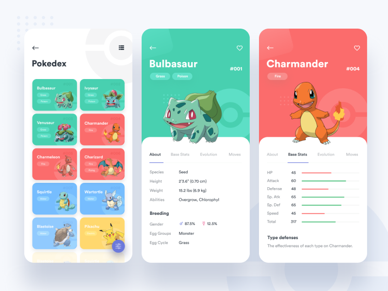

# flutter_pokedex_mobx

A new Flutter application.

Pokemon api: https://pokeapi.co/

## Getting Started

This project is a starting point for a Flutter application.

A few resources to get you started if this is your first Flutter project:

- [Lab: Write your first Flutter app](https://flutter.dev/docs/get-started/codelab)
- [Cookbook: Useful Flutter samples](https://flutter.dev/docs/cookbook)

For help getting started with Flutter, view our
[online documentation](https://flutter.dev/docs), which offers tutorials,
samples, guidance on mobile development, and a full API reference.

## MobX for Dart and Flutter
Introduction
MobX is a state-management library that makes it simple to connect the reactive data of your application with the UI (or any observer). 
This wiring is completely automatic and feels very natural. As the application-developer, 
    you focus purely on what reactive-data needs to be consumed in the UI (and elsewhere) without worrying about keeping the two in sync.

It's not really magic but it does have some smarts around what is being consumed (observables) and where (reactions), and automatically tracks it for you. 
When the observables change, all reactions are re-run. What's interesting is that these reactions can be anything from a simple console log, 
    a network call to re-rendering the UI.
    
[online documentation](https://mobx.netlify.app/)

## GetIt
This is a simple Service Locator for Dart and Flutter projects with some additional goodies highly inspired by Splat. It can be used instead of InheritedWidget or Provider to access objects e.g. from your UI.

[online documentation](https://github.com/fluttercommunity/get_it)

## APP UI

